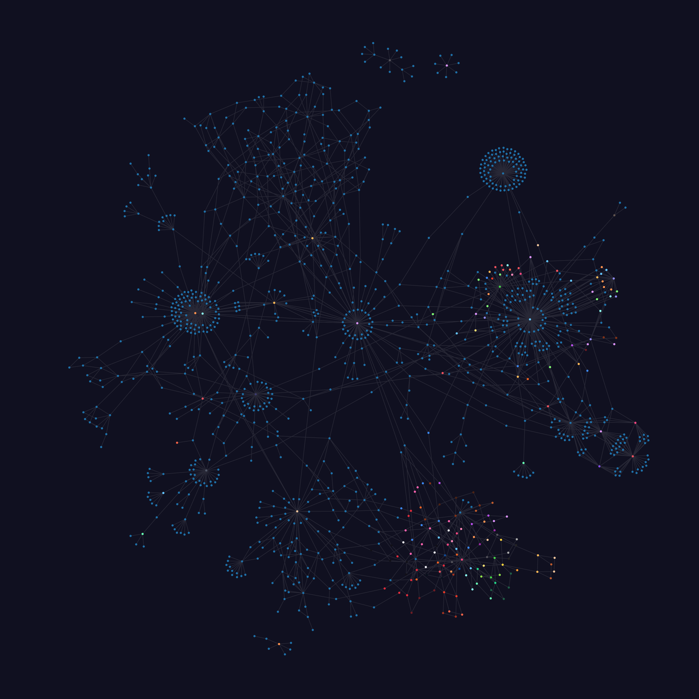

# Tag Map
A very, very quickly thrown together tool for generating a network graph of the tags in a [TagStudio](https://github.com/TagStudioDev/TagStudio) library.

## Warning
I didn't exactly intend for this to be public or used by anyone other than me, so be warned, this isn't very good. I may update it in the future, but don't count on it.

## Usage

### Prerequisites
- An IDE, such as [Visual Studio Code](https://code.visualstudio.com/)
- [Bun](https://bun.com/)

### Actually using the thing
- First, you'll need to `git clone` the repo to your local hard drive and open it in your IDE.
- Create a `.env` file in the project root, and put in `DATABASE_PATH = "<the path to your ts_library.sqlite file>"`.
- Run `bun run toJSON`, which creates a `data.json` file containing all of the node and edge data needed for the network graph.
  - You can also run `bun run toText`, which creates a `tags.md` file containing a list of every tag in your library, all of their aliases, and all of their parents. This isn't related to the network graph, but exists regardless.
- Open `index.html` in a web server ([Live Server](https://marketplace.visualstudio.com/items?itemName=ritwickdey.LiveServer) is useful for this) and look at your mess of a tag map!